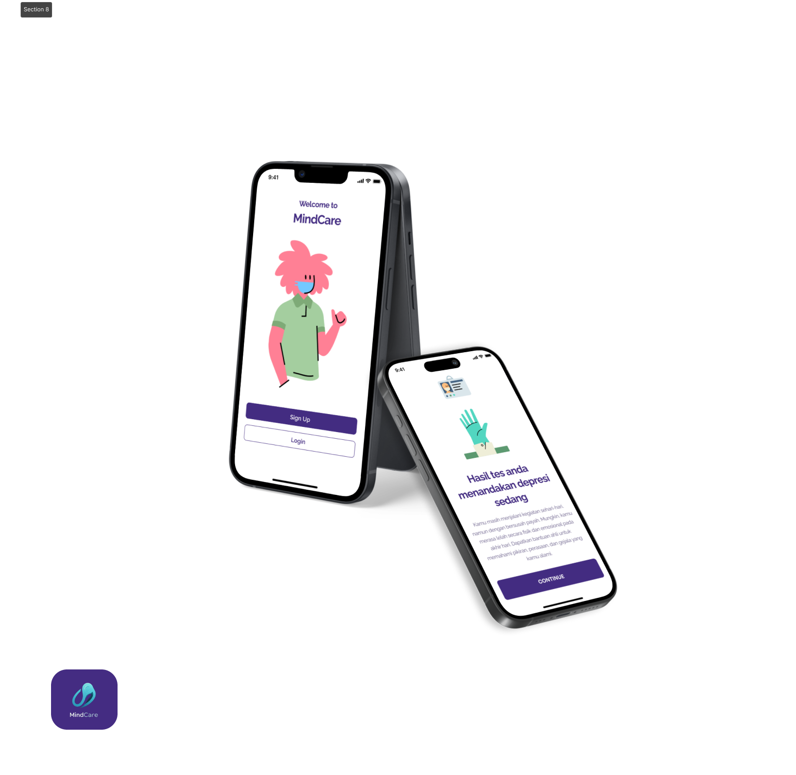

# MindCare-APP

## Know Your Mental Health
introducing our application is Mindcare. our application provides a questionnaire that can help users know how their mental health is. by knowing their mental health, they can find experts at the nearest location to consult related to mental health to prevent unwanted things. 
## Our Team C242-PS506
| ID-Bangkit   |  Name   |  University | Learning Path |
|-----------|------------|--------------|---------------|
| M211B4KY0393   | Aliffa Agnur     | Universitas Indraprasta PGRI     |Machine Learning|
| M284B4KY1880   | I Putu Hananda Weldy Nugraha    | Universitas Negeri Surabaya     |Machine Learning|
| M014B4KX3346   | Ni Putu Mirah Kartika Cahyani     | Universitas Udayana     |Machine Learning|
| A284B4KY1947   | Ilham Saputra     | Universitas Negeri Surabaya     |Mobile Development|
| C014B4KY2221   | Komang Bayu Lobi Hartawan     | Universitas Udayana     |Cloud Computing|
| C014B4KX3341   | Ni Putu Adelia Candra Swari     | Universitas Udayana     |Cloud Computing|

## Technology, Library and Resources
This Technology, Library and Resources that we use to develop Mindcare App
### Machine Learning
- Google Colab
- Dataset from Quisioner
- Tensorflow
- Pandas
- Numpy
- Matplotlib

### Cloud Computing
- Google Cloud Platform
- Express.js
- App Engine
- Cloud Run
- Cloud SQL
- Flask
- Node.js

### Mobile Development
- Kotlin
- Android Studio
- Retrofit

## Repositories
This our repositories to help us develop this application.

- Machine Learning  
https://github.com/KEPSTON1/Capstone-ML
- Cloud Computing  
https://github.com/KEPSTON1/Capstone-CC
- Mobile Development  
https://github.com/KEPSTON1/Capstone-MD
